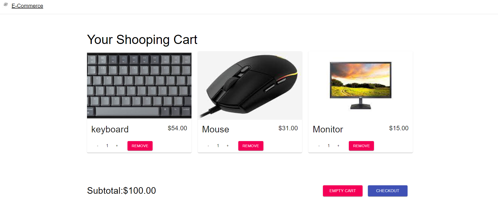
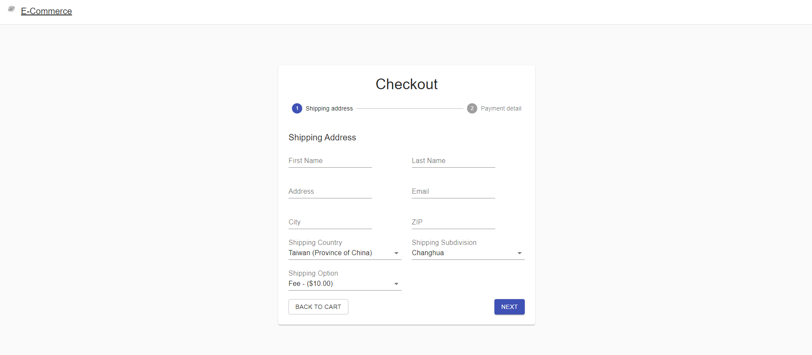
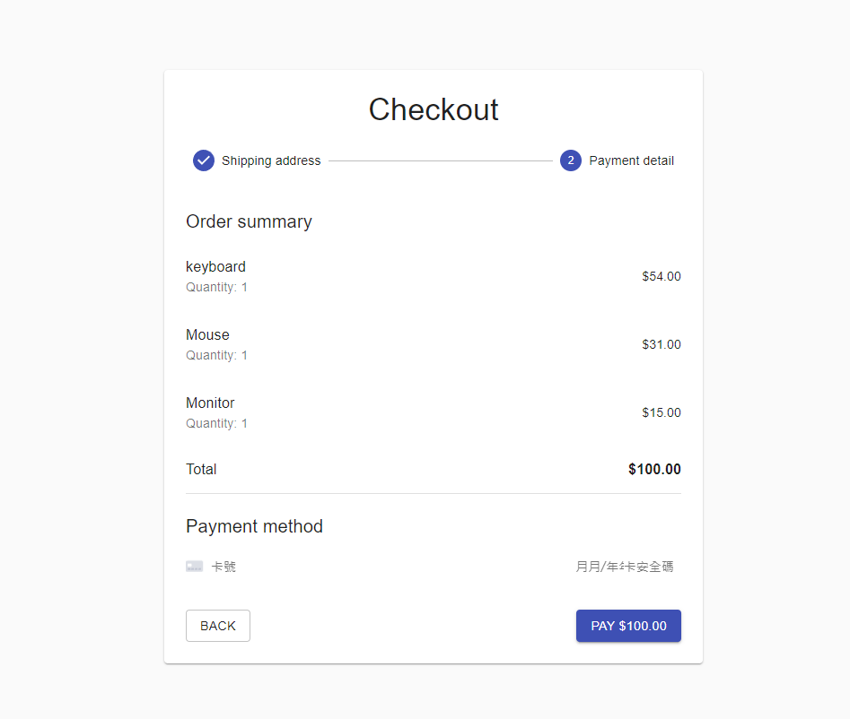
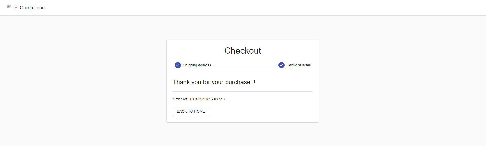

# E-Commerce App
## Views

## Libraries
### Main
- React.js
- Commerce.js
- Stripe.com

### Sub
- @material-ui/core
- react-hook-form
- react-router-dom

## Setup
### Third parties
- [Commerce.js](https://commercejs.com/)
- [Stripe.com](https://stripe.com/)
- put public-keys from both sites into ".env".

### Commands
- npm install @material-ui/core @material-ui/icons @chec/commerce.js @stripe/react-stripe-js @stripe/stripe-js react-router-dom react-hook-form

- npm start

